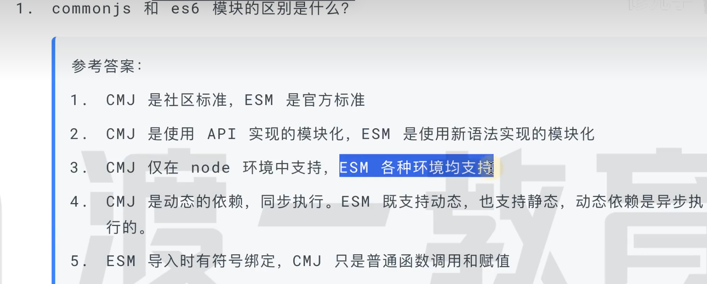

### 模块化

#### commonjs
- 社区标准
- 使用函数实现
- 仅node环境支持
- 动态依赖（需要代码运行后才能确定依赖）
- 动态依赖是同步执行的

```javascript
// require函数的伪代码
  function require(path) {
    if(该函数有缓存吗) {
      return 该模块的缓存结果
    }
    function _run(exports, require, module, __filename, __dirname) {
      模块代码会放在这里
    }

    var module = { exports: {} };

    _run.call(module.exports, module.exports, require, module, 模块路径, 模块所在目录);

    把module.exports 加入到缓存
    return module.exports;
  }
```

- 考法
```javascript
this = exports = module.exports
```

#### ES module
- 官方标准
- 使用新语法实现
- 所有环境均支持
- 同时支持静态依赖和动态依赖
  静态依赖：在代码运行前就要确定依赖关系，不能放到判断或者循环当中，必须放到最顶部
- 动态依赖是异步的
- 符号绑定




#### 当你导入一个模块，你实际上是在创建一个指向该模块导出值的引用。对于CommonJS，这是一个对导出对象的引用，你可以修改这个对象，但不能重新分配它。对于ES Modules，你不能修改导入的值，因为它们是只读的。

### 闭包

闭包是指有权访问另一个函数作用域中变量的函数。闭包可以使得这些变量的值始终保持在内存中，即使外部函数已经返回。它可以用来创建特定作用域，比如一个私有作用域，来存储特定变量。

闭包的原理是函数在定义时就会将其所在的上下文（作用域）绑定在其中，而不是在调用时绑定。这就是闭包的原理，也是它为什么可以访问外部函数作用域中的变量的原因。

闭包是由于 JavaScript 的*作用域链*和*词法环境*（也称为静态作用域或词法作用域）导致的。当一个函数被定义时，它的词法环境就被确定下来，这个环境包含了函数可以访问的所有变量、函数和参数。当这个函数被调用时，它会在执行栈的顶部创建一个新的执行上下文，这个执行上下文不仅保存了函数的局部变量和参数，还保存了一个指向函数词法环境的引用。通过这个引用，函数可以访问到它词法环境中的所有变量和函数，即使这个函数在词法环境之外被调用。这就是闭包的工作原理。

### js作用域

js是静态作用域（词法作用域），函数的作用域在定义时就决定了，而不是在调用时决定。
如果函数在其作用域内引用了一个变量，会先在其作用域内查找，找不到，就去上级作用域查找，一直到全局作用域，如果全局还找不到，则报错未定义。

### 闭包的应用

- 创建私有变量
- 延长变量的生命周期

### 闭包的缺点

- 闭包会使得函数中的变量都被保存在内存中，内存消耗很大，使用不当很容易造成内存泄露

## 继承

> 每个构造函数都有一个原型对象，原型有一个属性指回构造函数，而实例有一个内部指针指向原型。如果原型是另一个类型的实例呢？那就意味着这个原型本身有一个内部指针指向另一个原型，相应地另一个原型也有一个指针指向另一个构造函数。这样就在实例和原型之间构造了一条原型链。这就是原型链的基本构想。

### 通过原型链实现继承

子类原型指向父类实例，即将子类原型赋值为父类实例

> 以对象字面量方式创建原型方法会破坏之前的原型链，因为这相当于重写了原型链

#### 存在问题

1.高程解释：原型中包含引用值时，原型中包含的引用值会在所有实例间共享。在使用原型实现继承时，原型实际上变成了另一个类型的实例，这意味着原来的实例属性变成了原型属性

> 由于父类实例成为了子类原型，所以对父类实例引用属性的操作其实是对子类原型的操作，进而会影响到所有子类的实例
> 2.子类实例化时不能给父类构造函数传参

### 盗用构造函数实现继承-经典继承/对象伪装

#### 实现思路：

在子类构造函数中调用父类构造函数，使用apply()/call()以新创建的对象为上下文执行构造函数

#### 优点

- 可以在子类构造函数中向父类构造函数传参

```javascript
function SuperType(name){
this.name = name;
}
function SubType() {
// 继承SuperType 并传参
SuperType.call(this, "Nicholas");
// 实例属性
this.age = 29;
}
let instance = new SubType();
console.log(instance.name); // "Nicholas";
console.log(instance.age); // 29
```

#### 问题

盗用构造函数的主要缺点，也是使用构造函数模式自定义类型的问题：必须在构造函数中定义方法，因此函数不能重用。此外，子类也不能访问父类原型上定义的方法，因此所有类型只能使用构造函数模式。由于存在这些问题，盗用构造函数基本上也不能单独使用

### 组合继承

结合了原型链和盗用构造函数
基本思路：使用原型链继承原型上的属性和方法，盗用构造函数继承实例属性

> 构造函数中创建的属性，实例化后的对象显式拥有

```javascript
function SuperType(name){
this.name = name;
this.colors = ["red", "blue", "green"];
}
SuperType.prototype.sayName = function() {
console.log(this.name);
};
function SubType(name, age){
// 继承属性
SuperType.call(this, name);
this.age = age;
}
// 继承方法
SubType.prototype = new SuperType();
SubType.prototype.sayAge = function() {
console.log(this.age);
};
let instance1 = new SubType("Nicholas", 29);
instance1.colors.push("black");
console.log(instance1.colors); // "red,blue,green,black"
instance1.sayName(); // "Nicholas";
instance1.sayAge(); // 29
let instance2 = new SubType("Greg", 27);
console.log(instance2.colors); // "red,blue,green"
instance2.sayName(); // "Greg";
instance2.sayAge(); // 27
```

## async await

### 分块的程序

#### 回调函数

```javascript
function now() {
 return 21;
}
function later() {
 answer = answer * 2;
 console.log( "Meaning of life:", answer );
}
var answer = now();
setTimeout( later, 1000 ); // Meaning of life: 42
```

> 现在这一块在程序运行之后就会立即执行。但是，setTimeout(..) 还设置了一个事件（定时）在将来执行，所以函数 later() 的内容会在之后的某个时间（从现在起 1000 毫秒之后）执行。
> 任何时候，只要把一段代码包装成一个函数，并指定它在响应某个事件（定时器、鼠标点击、Ajax 响应等）时执行，你就是在代码中创建了一个将来执行的块，也由此在这个程序中引入了异步机制。

#### 异步控制台

控制台I/O可能会延迟
解决方法: 断点调试或对象序列化到一个字符串中,以强制执行一次快照,如 `JSON.stringfy()`


### 变量声明

* var 可以声明全局和局部变量
* 直接复制。`x=42` 函数中使用时会产生一个全局变量，严格模式下会报错
* let 。`let y = 43` 声明块作用域

### 变量求值

`var`和 `let`声明的变量，如果没有赋初始值，则值为 `undefined`，访问未声明的变量会抛出 `ReferenceError`异常

`undefined`在布尔环境中被当作 `false`
`undefined`在数值环境中被当作 `NaN`
`null`在数值环境中被当作 `0`,在布尔环境中被当作 `false`

### 变量作用域

- es6之前只有全局作用域和函数作用域
- es6增加了块级作用域
  
  ```javascript
  if (true) {
    let x = 5;
  }
  console.log(x); // ReferenceError: x is not defined
  ```

### 变量提升
先使用变量稍后再声明变量而不会引发异常，称之为变量提升。js引擎会将变量声明提升到作用域顶部，但是不会提升变量赋值

```javascript
console.log(x); // undefined
var x = 3;
```
相当于
```javascript
var x;
console.log(x); // undefined
x = 3;
```
`let`和`const`声明的变量也会被提升到代码块的顶部，但是不会被赋予初值，访问会报错(ReferenceError)这种现象称之为暂时性死区

### 函数提升
只有函数声明会被提升到顶部，函数表达式不会被提升

### 全局变量
全局变量是全局对象的属性，浏览器中是window对象，node中是global对象

### 常量
常量是指一旦声明就不能再改变值的变量，常量的声明和变量类似，只是在声明时使用const关键字，数组和对象的值可以改变，但是不能再次赋值

### 数据类型
8种数据类型，包含七种基本数据类型和一种复杂数据类型
- 基本数据类型
  - Number
  - String
  - Boolearn
  - null
  - undefined
  - Symbol
  - BigInt
- 复杂数据类型
  - Object

### 数据类型转换
1. 数字转为字符串。数字和字符串的表达式中用加法运算符`+`，js会把数字转换为字符串,其他运算符如减法运算符`-`，js会把字符串转换为数字
2. 字符串转为数字。`parseFloat()`、`Number()`、`parseInt()`、一元`+`运算符,
  ```javascript
  +'42' // 42
  ```
### 字面量
字面量是指能够表示数据类型的值，如字符串字面量、数字字面量、布尔字面量、对象字面量、数组字面量、函数字面量、正则表达式字面量
字面量和变量的区别是什么
字面量是数据类型的值，变量是存储数据的容器

### 实现一个批量请求函数，能够限制并发量

  ```javascript

  // 实现一个批量请求函数 multiRequest(urls, maxNum)，要求如下：  
  // • 要求最大并发数 maxNum
  // • 每当有一个请求返回，就留下一个空位，可以增加新的请求
  // • 所有请求完成后，结果按照 urls 里面的顺序依次打出
  
  // 1. 用promise实现
  function multiRequest(urls = [], maxNum) {
    // 请求总数量
    const len = urls.length;
    // 根据请求数量创建一个数组来保存请求的结果
    const result = new Array(len).fill(false);
    // 当前完成的数量
    let count = 0;
    return new Promise((resolve, reject) => {
      // 请求maxNum个
      while (count < maxNum) {
        next();
      }
      function next() {
        let current = count++;
        // 处理边界条件
        if (current >= len) {
          // 请求全部完成就将promise置为成功状态, 然后将result作为promise值返回
          !result.includes(false) && resolve(result);
          return;
        }
        const url = urls[current];
        console.log(`开始 ${current}`, new Date().toLocaleString());
        fetch(url)
          .then((res) => {
            // 保存请求结果
            result[current] = res;
            console.log(`完成 ${current}`, new Date().toLocaleString());
            // 请求没有全部完成, 就递归
            if (current < len) {
              next();
            }
          })
          .catch((err) => {
            console.log(`结束 ${current}`, new Date().toLocaleString());
            result[current] = err;
            // 请求没有全部完成, 就递归
            if (current < len) {
              next();
            }
          });
      }
    });
  }
